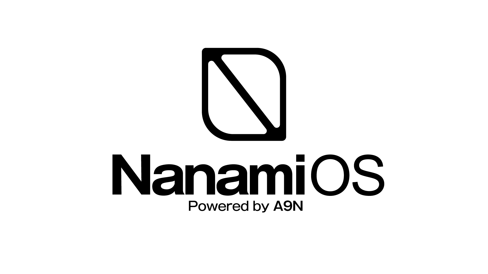

# Nanami OS

<p align="center">
  
</p>

Nanami is an experimental user-space operating system built on the
[A9N Microkernel](https://github.com/horizon2038/A9N). It keeps the kernel
small and implements OS policy, device drivers, filesystems, networking,
graphics, and ABI compatibility as isolated user processes connected through
capabilities and IPC.

Nanami is written primarily in Rust and uses the
[Nun](https://github.com/horizon2038/Nun) runtime. The complete bootable UEFI
image is assembled by [SPENCER](https://github.com/horizon2038/spencer), which
combines Nanami with A9N and
[A9NLoader-rs](https://github.com/horizon2038/a9nloader-rs).

> [!WARNING]
> Nanami is under active development. Its user-space ABI, service protocols,
> filesystem format assumptions, and supported application interfaces may
> change without compatibility guarantees.

## Architecture Overview

```text
UEFI
  -> A9NLoader-rs
  -> A9N Microkernel
  -> Nanami Alpha
       -> boot-critical services from initramfs
       -> system services from ext2 rootfs
       -> Honoka desktop and user session
```

The system is divided into the following layers:

- **A9N Microkernel** provides capability spaces, address spaces, scheduling,
  IPC, interrupt delivery, and the minimum hardware-dependent mechanisms.
- **Nun** provides the Rust runtime and entry ABI used by Nanami and its
  user-space programs.
- **Alpha** is Nanami's initial and privileged user process. It manages
  physical memory, processes, virtual memory metadata, service discovery, and
  privileged resource requests without moving those policies into the kernel.
- **Servers and drivers** implement storage, filesystems, networking, input,
  graphics, terminal sessions, timers, and POSIX-facing services as separate
  processes.
- **Honoka** is the compositor and window manager used by the graphical
  desktop.
- **Alter** provides user-space ABI personalities for running supported Linux
  and FreeBSD binaries on Nanami services.
- **SPENCER** builds A9N, A9NLoader-rs, Nanami, and the final UEFI disk image
  through a single build pipeline.

Nanami uses synchronous IPC for control operations and shared memory, DMA
buffers, ring buffers, and notifications for high-frequency data paths.
Drivers and subsystem servers are not linked into Alpha or the microkernel.

## Features

- Capability-based process, memory, device, and service management
- A user-space Device Driver Manager that selects platform drivers at boot
- User-space drivers for AHCI, virtio block/network, HPET, PIT, PS/2, RTC, and
  the boot framebuffer
- ext2 root filesystem with application and service manifests
- IPv4 networking with DHCP, ARP, ICMP, UDP, DNS, and TCP support
- Honoka compositing desktop with shared-memory windows and input delivery
- Terminal service and graphical shell
- POSIX-oriented file descriptor, process, filesystem, terminal, and socket
  services
- Alter/Linux and Alter/FreeBSD syscall emulation layers
- Native Rust and freestanding C++ application SDKs
- Runtime memory and process inspection through `nanami-info` and the graphical
  performance monitor

## Boot Model

Nanami separates boot policy into three stages:

1. `nanami/servers/boot-list` is embedded in the initramfs and contains only
   boot-critical services. The Device Driver Manager selects the timer and
   block drivers before VFS and the system manager consume them.
2. `/nanami/system-list` is read from the ext2 root filesystem and starts upper
   services such as networking, input, graphics, POSIX, and Alter.
3. `/nanami/session-list` starts the user session after system services are
   available. The default session launches the graphical shell.

This keeps Alpha independent of desktop, application, and root filesystem
policy.

## Supported Targets

| Architecture | Platform | Status |
| --- | --- | --- |
| x86_64 | QEMU/UEFI | Supported |
| AArch64 | QEMU `virt`/U-Boot | Supported (headless) |
| AArch64 | Hardware | Planned |
| riscv64 | QEMU or hardware | Planned |

x86_64's user-space Device Driver Manager maps the RSDP supplied in
`arch_info[0]`, validates the RSDP and XSDT/RSDT, and discovers HPET itself.
It selects AHCI through PCI, with virtio-blk and PIT retained as fallbacks.
AArch64 uses a PCI boot disk and a modern virtio-mmio root disk on QEMU `virt`
with GICv2. Its user-space timer is intentionally deferred: EL0 access to the
architectural virtual timer is not enabled or exposed.

## Requirements

- Rust nightly specified by `rust-toolchain.toml`, including `rust-src`
- LLVM/Clang toolchain with `clang`, `clang++`, `llvm-ar`, and LLD
- CMake
- GNU Make
- Python 3
- QEMU with x86_64 and/or AArch64 system emulation
- NASM for the x86_64 A9N HAL
- Git with submodule support

OVMF firmware files used by the QEMU launcher are provided through the
A9NLoader-rs submodule.

## Build

Clone the repository together with SPENCER and its nested components:

```bash
git clone --recursive git@github.com:horizon2038/Nanami.git
cd Nanami
```

If the repository was cloned without submodules:

```bash
git submodule update --init --recursive
```

Build the bootable release image:

```bash
make image
make image ARCH=aarch64
```

This command performs the following steps:

1. Builds Nanami core services and applications.
2. Creates the boot initramfs and the ext2 root filesystem.
3. Builds Nanami as an external Nun payload.
4. Builds A9N with SMP enabled.
5. Delegates A9NLoader-rs and disk-image assembly to SPENCER.

The resulting boot images are written to:

```text
spencer/out/x86_64-pc99-release/spencer.img
spencer/out/aarch64-qemu-release/spencer.img
```

The default Spencer platform is `pc99` for x86_64 (both QEMU and hardware),
and `qemu` for AArch64. If setting `PLATFORM` explicitly, use these names;
`PLATFORM=qemu` is no longer valid for x86_64.

The x86_64 `spencer.img` is a complete GPT disk image. It contains a FAT32 EFI
System Partition with A9NLoader, A9N, and Nanami, followed by a Nanami ext2 root
partition. The storage driver discovers the root partition by its GPT type GUID
(`6e616e61-6d69-4f53-a000-4e414e414d49`), so the boot and root filesystems do not
need separate drives.

The ext2 root filesystem can also be created explicitly:

```bash
make fs-image SIZE_MB=64 OUT=out/ext2.img
make fs-image ARCH=aarch64 SIZE_MB=64
```

Without `OUT`, the AArch64 rootfs is written to `out/ext2-aarch64.img`.

## Run with QEMU

Build the system, create or refresh the ext2 root filesystem, and launch QEMU:

```bash
make run
make run ARCH=aarch64
```

The AArch64 QEMU profile is currently headless and uses `NET_MODE=none`. It does
not start a user session until platform timer, display, and input drivers are
available.

On Linux, user-mode networking is selected by default. On macOS, bridged
`vmnet` networking is selected and the default IPv4 interface is detected
automatically.

Use QEMU user networking explicitly:

```bash
NET_MODE=user make run
```

Use bridged networking on a selected host interface:

```bash
NET_MODE=bridged BRIDGE_IF=en0 make run
```

Useful run-time options include:

| Variable | Default | Purpose |
| --- | --- | --- |
| `NET_MODE` | host default on x86_64; `none` on AArch64 | `user`, `bridged`, or `none` |
| `NET_DEVICE` | `virtio` | `virtio` or `e1000` |
| `QEMU_MEMORY` | `4G` | Guest memory size |
| `QEMU_SMP` | `4` | Guest CPU count (1–64) |
| `QEMU_ACCEL` | `auto` | QEMU accelerator, or `none` |
| `QEMU_HPET` | `on` | x86_64 HPET exposure; use `off` to test the PIT fallback |
| `STORAGE_DEVICE` | `ahci` | x86_64 root disk controller: `ahci` or `virtio` |
| `BLOCK_IMAGE` | `out/ext2.img` or `out/ext2-aarch64.img` | ext2 staging image; on x86_64 it is embedded in `spencer.img` |
| `SIZE_MB` | `64` | Default root filesystem size |
| `PCAP` | `out/net0.pcap` | Bridged network capture, or `none` |

With user networking, guest TCP port 80 is forwarded to
`127.0.0.1:1234` by default. This can be changed with `HOSTFWD_HTTP`.
`QEMU_ACCEL=auto` uses KVM on Linux when available, HVF on Intel macOS, and
software emulation for x86_64 guests on Apple Silicon.

## Boot on x86_64 hardware

`make image` produces the complete disk image at
`spencer/out/x86_64-pc99-release/spencer.img`. Write that one image to a whole,
dedicated SATA/AHCI disk, then select its UEFI boot entry. USB mass storage and
NVMe are not storage backends yet: firmware may load the EFI partition from
them, but Nanami cannot mount the root partition after handoff. The write
replaces the target disk's partition table and all existing contents, so
identify the device by model and capacity and unmount its volumes before
writing; do not use a system disk or a partition path. The firmware must support
x86_64 UEFI, and Secure Boot must be disabled unless the EFI loader is signed.

At runtime, the driver scans AHCI controllers and ports and accepts only a disk
containing exactly one Nanami root partition. It exposes partition-relative I/O
to ext2-server and refuses ambiguous multi-disk configurations instead of
choosing an arbitrary writable disk.

Nanami reads the architecture name, platform name, and available core count
from A9N v0.3.0's `init_info`; it does not probe PCB affinities to discover cores.
Alpha stays on logical Core 0. Services and applications are assigned to
the remaining cores in round-robin order. A single-core guest remains
supported and places all processes on Core 0. Inside the guest,
`nanami-info smp` reports the topology, and `nanami-info platform` reports the
kernel-supplied architecture, platform, and available core count.

## External ABI Binaries

The root filesystem builder can install external binaries for Alter. For
example:

```bash
EXTRA_LINUX_BINS="/path/to/busybox /path/to/iwasm" make fs-image
EXTRA_FREEBSD_BINS="/path/to/sh" make fs-image
```

Linux binaries are installed under `/alter/linux/bin`; FreeBSD binaries are
installed under `/alter/freebsd/bin`. Alter/Linux selects x86_64 or AArch64
syscall numbers, register layouts, ELF machine validation, and Linux structure
layouts at build time. Its filesystem subset includes `link(2)`/`linkat(2)`, so
BusyBox applet installation can create hard links. Compatibility still depends
on the syscalls and flags used by each program.

## Repository Structure

```text
.
├── nanami/
│   ├── src/                    # Alpha and Nanami OS core
│   ├── docs/                   # Architecture and application documentation
│   └── servers/
│       ├── core-services/      # Boot-critical initramfs services
│       ├── apps/               # Rootfs services and applications
│       └── sdk/                # Rust and C++ user-space SDKs
├── scripts/                    # Image, rootfs, and QEMU orchestration
├── spencer/                    # SPENCER, A9N, Nun, and A9NLoader-rs
├── targets/                    # Nanami Rust target specifications
└── Makefile                    # Top-level build interface
```

## Documentation

- [Nanami Architecture](./nanami/docs/architecture.md)
- [Application Guide](./nanami/docs/application.md)
- [Coding Guidelines](./nanami/docs/coding-guideline.md)
- [Refactoring Guidelines](./nanami/docs/refactor-guideline.md)
- [User SDK](./nanami/servers/README.md)
- [Alter/Linux supported syscalls](./nanami/servers/apps/alter/linux/linux-supported-syscalls.md)
- [Alter/FreeBSD supported syscalls](./nanami/servers/apps/alter/freebsd/freebsd-supported-syscalls.md)

## Related Projects

- [A9N](https://github.com/horizon2038/A9N): capability-based microkernel
- [Nun](https://github.com/horizon2038/Nun): Rust runtime for A9N user-space
  operating systems
- [A9NLoader-rs](https://github.com/horizon2038/a9nloader-rs): Rust UEFI
  bootloader implementing the A9N Boot Protocol
- [SPENCER](https://github.com/horizon2038/spencer): integrated build, image,
  run, and debugging toolkit for A9N-based systems

## Author

horizon2k38 (Rekka "horizon" IGUMI)

## License

[MIT License](https://choosealicense.com/licenses/mit/)
